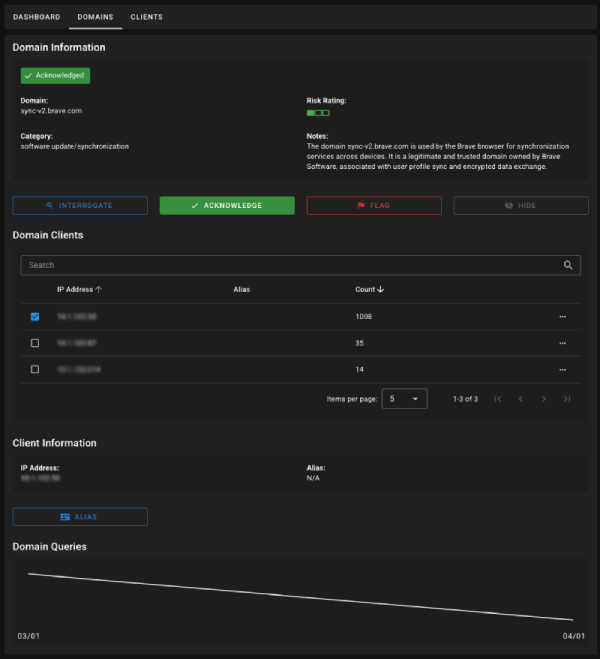

# PiHole Analysis Tool
An extension to PiHole, enabling analysis of DNS behaviour within the network. Automatically interrogate domains, flag domains as suspicious, and identify trends.



## PiHole Setup
The following guide will configure the PiHole to export 24 hours worth of query results (domain, client, count) to an encrypted file, accessible via a web server on a separate port.

### Install & Configure nginx
Install nginx
```
sudo apt install nginx
```

Create a new www path
```
sudo mkdir -p /var/www/html/dump
```

Modify the default nginx site

```
sudo nano /etc/nginx/sites-available/default
```

Change the listen port to '8888'

```
listen 8888 default_server;
listen [::]:8888 default_server;
```

Change the root path to '/var/www/html/dump'
```
root /var/www/html/dump;
```

Save and exit the file

Enable and start the nginx service

```
sudo systemctl enable nginx
sudo systemctl start nginx
```

## Configure The Exporter
Copy the contents of the [dump.sh](./backend/scripts/dump.sh) script to `/root`


Create a cron job to run the script

```
sudo crontab -e
```

Add the following line, feel free to change the frequency:

```
/30 * * * * ~/dump.sh PASSWORD
```

Be sure to change 'PASSWORD' to something else

## Backend Setup

### Example .env
```
PIHOLE_URL="http://192.168.1.10"
PIHOLE_DUMP_PORT="8888"
PIHOLE_DUMP_KEY="PASSWORD"

WEB_ADDR="127.0.0.1"
WEB_PORT="8000"
WEB_SECRET="SOME_OTHER_PASSWORD"

OPENAI_KEY="sk-...(optional)"
```